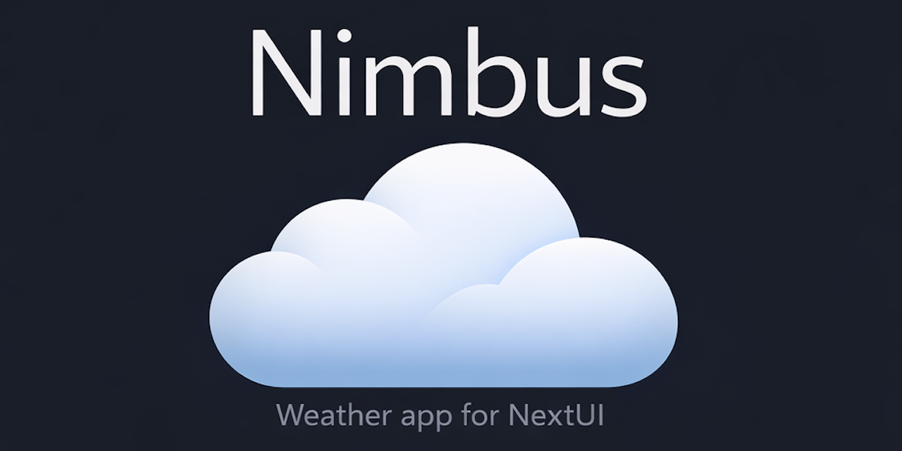
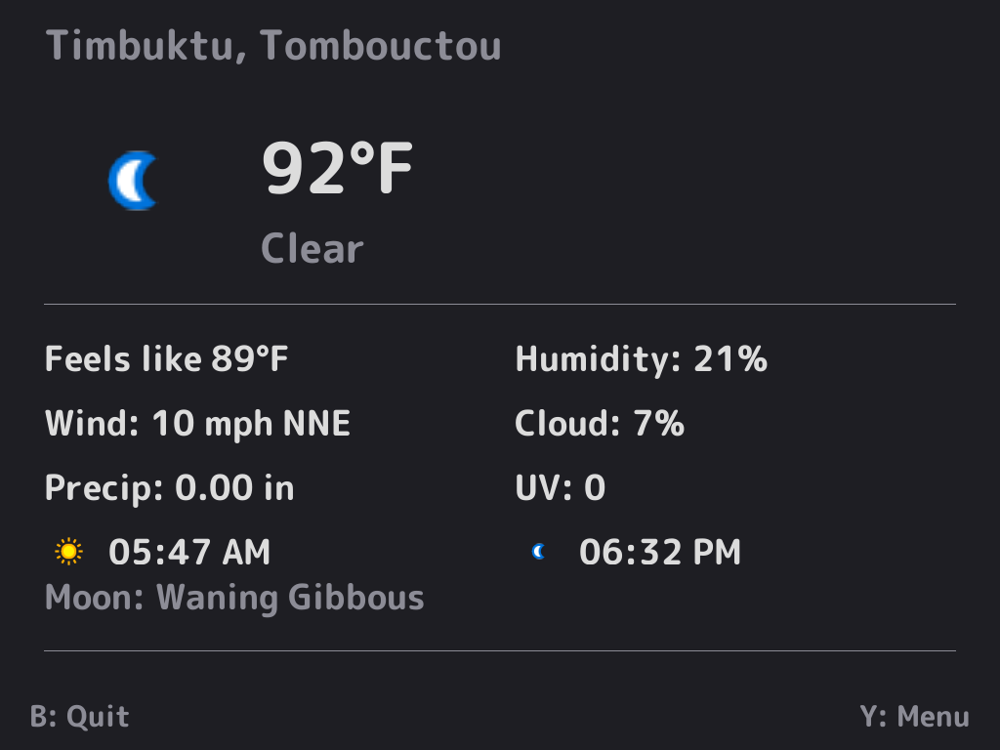
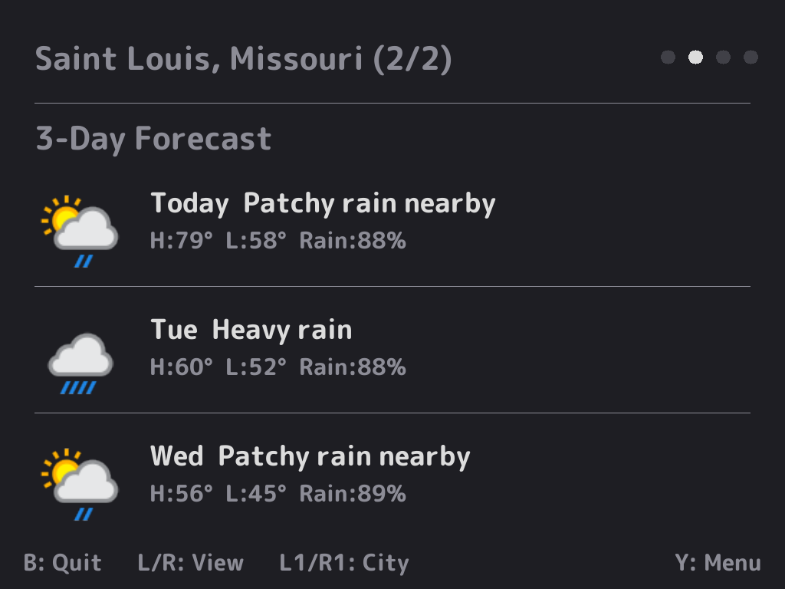
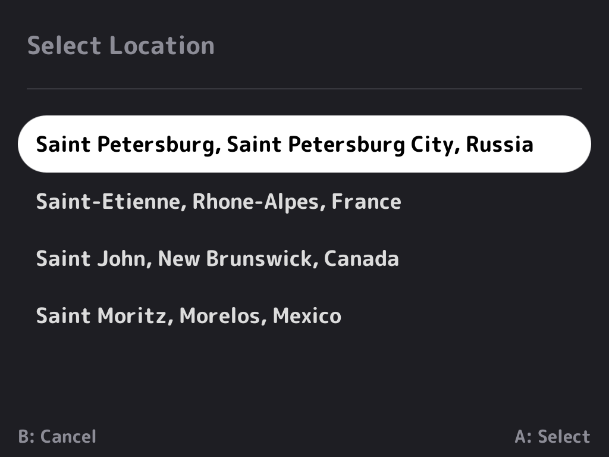
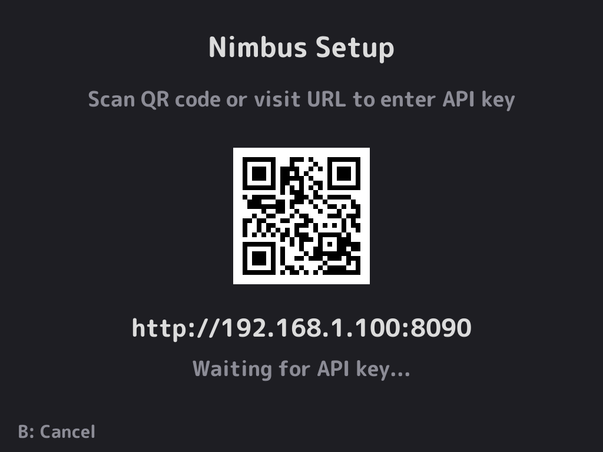
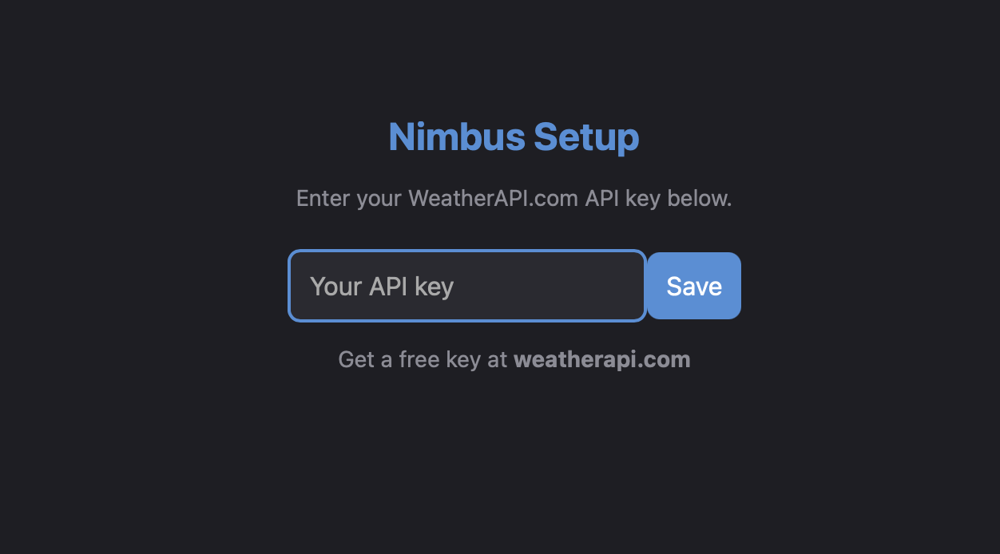

# Nimbus

A weather app for [NextUI](https://github.com/LoveRetro/NextUI) on TrimUI handheld devices.

Built with [PakKit](https://github.com/ericreinsmidt/pakkit) and [Apostrophe](https://github.com/Helaas/Apostrophe). Weather data provided by [WeatherAPI.com](https://www.weatherapi.com).

## Features

- **Current conditions** -- temperature, feels like, humidity, wind, precipitation, cloud cover, UV index
- **3-day forecast** -- daily high/low, condition, chance of rain with weather icons
- **Sunrise & sunset** with inline condition icons
- **Moon phase** display
- **F / C toggle** in settings
- **Location search** -- search by city name, zip code, or postal code via on-screen keyboard
- **QR code setup** -- enter your API key from your phone by scanning a QR code on the device screen
- **Auto-detect location** -- uses IP geolocation on first launch if no location is configured
- **Weather condition icons** -- fetched from WeatherAPI and cached locally
- **WiFi detection** -- checks for WiFi before fetching weather or starting QR setup
- **Scrollable layout** -- all weather data on a single custom-drawn screen
- **Minimal UI** -- clean PakKit screens with subtle button hints

## Supported Devices

| Device | Platform | Status |
|--------|----------|--------|
| TrimUI Brick | tg5040 | Working |
| TrimUI Smart Pro | tg5040 | Working |

## Screenshots

| Current | Forecast | Location Search |
|---------|----------|-----------------|
|  |  |  |

| QR Setup | API Key |
|----------|---------|
|  |  |

## Setup

### 1. Get an API Key

Sign up for a free account at [weatherapi.com](https://www.weatherapi.com) and copy your API key.

### 2. Install

Download the latest Nimbus.tg5040.pak.zip from [Releases](https://github.com/ericreinsmidt/nextui-nimbus/releases).

Extract and copy the Nimbus.pak folder to your SD card:

    /mnt/SDCARD/Tools/tg5040/Nimbus.pak/

### 3. Enter Your API Key

Launch Nimbus from the Tools menu. On first launch you'll see a QR code screen:

1. **Scan the QR code** with your phone (or visit the URL shown on screen)
2. **Enter your API key** on the web page that opens
3. **Tap Save** -- Nimbus will pick up the key and load your weather

Alternatively, you can manually create the file:

    /mnt/SDCARD/.userdata/tg5040/nimbus/config/api_key.txt

with your API key as the only line.

### 4. Set Your Location

On first launch, Nimbus auto-detects your location from your IP address. To change it:

1. Press **Y** to open the menu
2. Select **Set Location**
3. Type a city name, zip code, or postal code
4. Select your location from the results

## Controls

| Button | Action |
|--------|--------|
| **B** | Quit |
| **Y** | Settings menu |
| **Up/Down** | Scroll weather data |

### Settings Menu

- **Units** -- toggle between F and C
- **Set Location** -- search and select a new location
- **Change API Key** -- re-run the QR code setup to enter a new key
- **About** -- version and credits

## Device Paths

| Path | Description |
|------|-------------|
| /mnt/SDCARD/Tools/tg5040/Nimbus.pak/ | App installation |
| /mnt/SDCARD/.userdata/tg5040/nimbus/config/api_key.txt | API key |
| /mnt/SDCARD/.userdata/tg5040/nimbus/config/location.txt | Saved location |
| /mnt/SDCARD/.userdata/tg5040/nimbus/config/settings.txt | User settings |
| /mnt/SDCARD/.userdata/tg5040/nimbus/cache/ | Cached weather icons |
| /mnt/SDCARD/.userdata/tg5040/logs/nimbus.txt | Log file (current session only) |

## Building from Source

Requires Docker and the NextUI tg5040 toolchain image.

### Prerequisites

Clone the repo with submodules:

    git clone --recurse-submodules https://github.com/ericreinsmidt/nextui-nimbus.git
    cd nextui-nimbus

### First-Time Setup

Build the static curl and OpenSSL libraries (only needed once):

    docker run --rm -v "$(pwd)":/workspace ghcr.io/loveretro/tg5040-toolchain \
      /workspace/third_party/apostrophe/scripts/build_third_party.sh ensure-curl tg5040

Stage CA certificates (only needed once):

    mkdir -p build/tg5040
    docker run --rm -v "$(pwd)":/workspace ghcr.io/loveretro/tg5040-toolchain \
      /workspace/third_party/apostrophe/scripts/build_third_party.sh stage-runtime-libs tg5040 \
      /workspace/build/tg5040/nimbus /workspace/build/tg5040/lib

### Build

    make build

### Package

Copy the binary and CA certs into the pak:

    cp build/tg5040/nimbus ports/tg5040/pak/bin/nimbus
    chmod +x ports/tg5040/pak/bin/nimbus
    mkdir -p ports/tg5040/pak/lib
    cp build/tg5040/lib/cacert.pem ports/tg5040/pak/lib/cacert.pem

### Create Release Zip

    mkdir -p dist
    cd ports/tg5040/pak && zip -r../../../dist/Nimbus.tg5040.pak.zip. && cd../../..

### Deploy

Copy ports/tg5040/pak/ to /Tools/tg5040/Nimbus.pak/ on your SD card.

## Tech Stack

- **Language:** C (single-file architecture)
- **UI Components:** [PakKit](https://github.com/ericreinsmidt/pakkit) + [Apostrophe](https://github.com/Helaas/Apostrophe) by Helaas
- **Weather Data:** [WeatherAPI.com](https://www.weatherapi.com) (free tier)
- **JSON Parsing:** [cJSON](https://github.com/DaveGamble/cJSON)
- **QR Code Generation:** [QR-Code-generator](https://github.com/nayuki/QR-Code-generator) by nayuki
- **HTTP:** libcurl with static OpenSSL
- **Target:** TrimUI Brick / Smart Pro (tg5040) running NextUI

## Credits

- **Nimbus** by Eric Reinsmidt
- **[PakKit](https://github.com/ericreinsmidt/pakkit)** UI components by Eric Reinsmidt
- **[Apostrophe](https://github.com/Helaas/Apostrophe)** UI toolkit by [Helaas](https://github.com/Helaas)
- **[NextUI](https://github.com/LoveRetro/NextUI)** by [LoveRetro](https://github.com/LoveRetro)
- Weather data by [WeatherAPI.com](https://www.weatherapi.com)
- QR code generation by [nayuki](https://github.com/nayuki/QR-Code-generator)
- JSON parsing by [DaveGamble/cJSON](https://github.com/DaveGamble/cJSON)
- QR code setup inspired by [LogJack](https://github.com/BrandonKowalski/nextui-logjack) by [Brandon Kowalski](https://github.com/BrandonKowalski)

## License

MIT -- see [LICENSE](LICENSE) for details.
